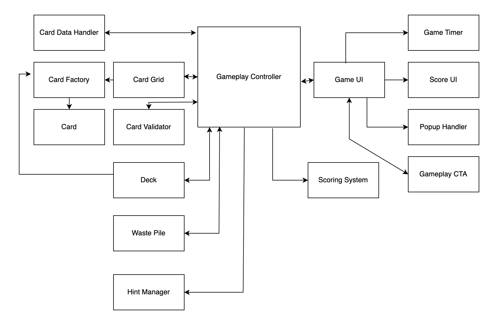

# TriPeaks Solitaire Unity Project

## Introduction
This README outlines the "TriPeaks Solitaire" Unity project, designed using version 2022.3.36f1. This project implements the classic TriPeaks Solitaire game where players clear cards by matching with the waste pile based on numerical adjacency.

## Getting Started

### Requirements
- **Unity**: Download the 2022.3.36f1 version of Unity from [Unity's official site](http://unity3d.com/get-unity).

### Installation
1. **Clone or Download Repository**: Clone this repository to your local machine or download it as a ZIP and extract it.
2. **Open Project in Unity**: Start Unity Hub, click 'Add', and navigate to the project directory.

## Game Mechanics

### Gameplay
The game starts with cards arranged in three pyramids, overlaid with ten face-up cards. The objective is to clear the board by selecting cards that are numerically adjacent to the top card of the waste pile.

### Controls
- **Tap Card**: Select a card that matches the waste pile's top card.
- **Deck Interaction**: Draw new cards when no moves are available.
- **Hint System**: Get suggestions for possible moves.

## Project Structure

### Key Directories and Files
- **Scripts**: Contains all C# scripts, organized by functionality:
  - **Card**: Manages card behaviors.
  - **UI**: Manages user interface components.
  - **Model**: Handles game logic and data operations.
- **Prefabs**: Includes reusable game object templates.
- **Scenes**: Contains Unity scene files for the game setup.

### Architecture and Components
- **MVC Pattern**: Used to separate concerns across the Model (game logic), View (UI components), and Controller (gameplay control).
- **Component Pattern**: Utilized extensively to build game objects with modular and interchangeable components.

#### Diagram
Refer to `ArchitectureDiagram.drawio.png` in the project files for a visual representation of the game's architecture.

### Design Patterns

In this project, several design patterns are employed to ensure a clean, maintainable, and scalable architecture. These patterns help in managing game state, creating game objects, and handling interactions and updates efficiently.

#### Factory Pattern
- **Usage**: The Factory pattern is utilized within the `CardFactory` class, which is responsible for creating instances of `CardScript` objects. This centralizes card creation logic, making the system easier to maintain and extend.
- **Benefits**: By using the Factory pattern, the system can instantiate cards with various properties without having to directly couple code with the specific types of cards being created. This promotes a flexible and decoupled system architecture.

#### Dependency Injection
- **Usage**: Dependency injection is widely used throughout the project to supply objects with their dependencies. For example, `CardGrid` and `Deck` are injected with dependencies like `ICardFactory` and `ICardDataHandler` which they require for operation.
- **Benefits**: Dependency injection reduces the dependency coupling between components, making the system easier to manage and test. It also allows for greater flexibility in changing dependencies without modifying the components themselves.

#### Observer Pattern
- **Usage**: The Observer pattern is implemented via events to handle score updates and game state notifications across various UI components. The `GamePlayScoringSystem` uses events to notify the `GameUI` when changes occur.
- **Benefits**: This pattern allows for a low-coupling between the state of the game and the components that display this state (like the UI). UI components subscribe to these events and update themselves accordingly when the game state changes, promoting a reactive architecture.

### Component Descriptions

#### Card Data Handler
**Purpose**: Manages the card data.

#### Card Factory
**Purpose**: Creates card instances to abstract instantiation logic for different card properties.

#### Card
**Purpose**: Represents an individual card, holding its state such as rank, suit, and whether it is face up or down.

#### Card Validator
**Purpose**: Validates the picking of cards based on the game's rules.

#### Card Grid
**Purpose**: Manages the arrangement and positioning of cards in the gameplay area.

#### Deck
**Purpose**: Manages the deck from which new cards are drawn, including storage and retrieval.

#### Waste Pile
**Purpose**: Manages the area where cards are moved during gameplay.

#### Hint Manager
**Purpose**: Provides gameplay hints by highlighting possible moves.

#### Gameplay Controller
**Purpose**: Central controller for managing game logic and player interactions.

#### Game UI
**Purpose**: Manages all user interface elements, providing interaction and feedback to the player.

#### Popup Handler
**Purpose**: Manages pop-up dialogs and alerts to enhance user interaction without cluttering the main interface.

#### Game Timer
**Purpose**: Tracks and displays the time spent on the current game.

#### Scoring System
**Purpose**: Calculates the score based on player actions.

## Building and Running
1. **Build the Project**: Navigate to `File > Build Settings` in Unity, select the target platform, and click 'Build'.
2. **Run Locally**: Test and debug directly within Unity's editor.
